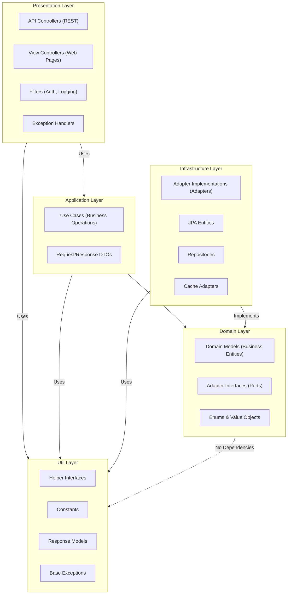

# Architecture Overview

## Principles

1. **Dependency Rule**: Dependencies point inward toward the domain layer
2. **Independence**: Business logic is independent of frameworks, databases, and external services
3. **Testability**: Each layer can be tested independently
4. **Framework Independence**: Core business logic doesn't depend on Spring or other frameworks

## Layer Structure

## Layer Responsibilities

| Layer | Responsibility |
|-------|---------------|
| **Presentation** | HTTP requests/responses, authentication, view rendering |
| **Application** | Orchestrates business operations through use cases |
| **Domain** | Core business logic, entities, adapter interfaces (ports) |
| **Infrastructure** | Implements adapters, database access, external services |
| **Util** | Shared utilities, constants, base classes |

## Patterns

### Clean Architecture

- **Ports**: Adapter interfaces defined in the domain layer
- **Adapters**: Implementations provided by the infrastructure layer
- **Use Cases**: Annotated with `@UseCase`, one business operation each, single public method, `@Transactional` boundary at this level

### Domain-Driven Design

- Domain models are immutable Java records
- Factory methods ensure valid domain object creation
- Value objects represented as enums
- Business rules enforced in domain models

## Key Features

### Database Replication

- Primary handles writes; replicas handle reads (load balanced)
- `@Transactional(readOnly = true)` automatically routes to replicas

### Caching Strategy

- Redis for application cache and session storage
- Cache keys: `CACHE_<ENTITY>_<OPERATION>_{id}` (e.g. `CACHE_ADMINISTRATOR_DETAIL_{id}`)
- Check cache first on reads; invalidate on writes

### Authentication

- API: JWT (stateless)
- Web: HTTP sessions stored in Redis
- Authorization: `@PreAuthorize` with Spring Security authorities

### ResultWrapper Pattern (command use cases)

- Command use cases return `ResultWrapper<T>`, wrap logic in `ResultHandler.handle(Supplier<T>)`
- Controller checks `result.isSuccess()`; maps `result.getErrors()` on failure
- References: `application/base/ResultWrapper.java`, `application/base/ResultHandler.java`
