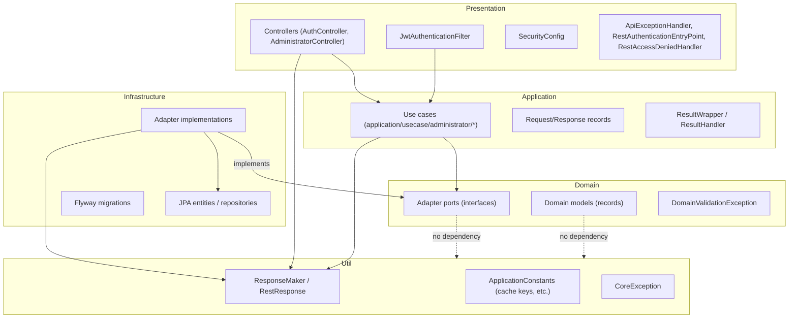
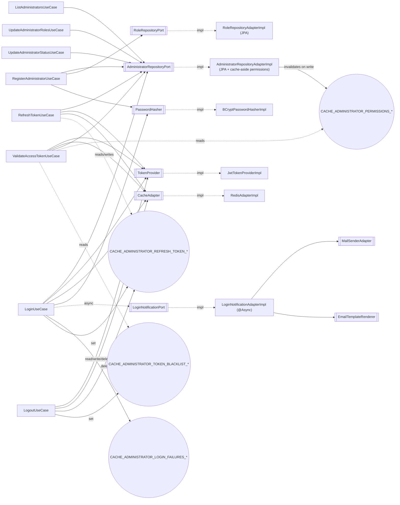

# Project Overview — thanhnd-demo-claude

## Document metadata

| Field | Value |
| --- | --- |
| Created | 2026-07-24 |
| Author | thanhnd (generated by Claude Code from full codebase scan) |
| Version | 1.0 |
| Purpose | Single reference for tech stack, features, and cross-feature dependencies, so a new feature can be planned without re-reading the whole source tree. |

**Maintenance rule**: this document (its tables and diagrams) MUST be updated whenever a use case, port, adapter, controller endpoint, cache key, or error code is added/changed/removed. See `.claude/rules/implement-mode.md`.

**Companion visualization**: [`docs/architecture/architecture-map.html`](architecture-map.html) is a self-contained, interactive HTML rendering of this same document (module tree, dependency graph, request pipeline, endpoint/error-code/cache-key tables, known gaps). It MUST be kept in sync every time this document changes — see §9 and `.claude/rules/implement-mode.md`.

---

## 1. Tech stack

| Concern | Choice |
| --- | --- |
| Language / runtime | Java 25 |
| Framework | Spring Boot 4.0.1 (parent POM) |
| Build | Maven, 6 modules: `util → domain → application → infrastructure → presentation → web` |
| Database | MySQL 8.4, primary + 1 replica (`mysql-connector-j` 9.1.0), Flyway migrations |
| Read/write routing | Custom `ReplicationRoutingDataSource` + `ReplicaHealthChecker`: writes → primary, reads → healthy replica (round-robin), routed by `@Transactional(readOnly=...)`. Health check every 30s, unhealthy after 3 consecutive failures, 60s cooldown. |
| Cache / session store | Redis 7 (`spring-boot-starter-data-redis`), custom `CacheAdapter` port, `GenericJackson2JsonRedisSerializer` + `JavaTimeModule` |
| Auth | JWT (jjwt 0.12.6, HS-signed) for stateless API auth; Spring Security (`spring-boot-starter-security`), method security (`@PreAuthorize`) |
| Password hashing | BCrypt (`spring-security-crypto`) |
| Object mapping | MapStruct 1.6.3 (entity ↔ domain), Lombok 1.18.44 (infrastructure/presentation only — never on domain models) |
| Email | Spring Mail + Thymeleaf templates. First template in use: `email/login-notification` (login notification) |
| Async | `@EnableAsync` (Spring, default `SimpleAsyncTaskExecutor`) — added for fire-and-forget login notification email; first async usage in the project |
| i18n | `MessageSource` (Spring Boot default `ResourceBundleMessageSource`, `web/src/main/resources/messages(_vi).properties`) resolves every `error_code` to a human message. Locale from `Accept-Language` via `AcceptHeaderLocaleResolver` bean (`presentation/.../config/LocaleConfiguration.java`), default English, supports `en`/`vi` |
| Object storage | Port defined (`ObjectStorageAdapter`), **no implementation yet** |
| API docs | springdoc-openapi 3.0.3 (`springdoc-openapi-starter-webmvc-ui`, first Boot-4-compatible line) — `OpenApiConfig` (presentation/config) defines metadata + `bearerAuth` JWT security scheme; UI/spec public at `/swagger-ui/**` and `/v3/api-docs`, enabled in all profiles |
| Logging | Log4j2 (default Spring logging excluded) |
| Reverse proxy | Nginx (Docker) |
| Containerization | Docker Compose: `mysql-primary`, `mysql-replica`, `redis`, `app`, `nginx` |
| API prefix | `server.servlet.context-path=/api/v1` (all endpoints below are relative to this) |

Maven profiles: `local` (default), `test`, `prod` — select `application-{profile}.properties`.

---

## 2. Layer dependency diagram (module level)

Full narrative version: `.claude/core/architecture.md`. Module folder layout: `.claude/core/modules.md`.

---

## 3. Feature catalog (use cases)

Only one business domain exists today: **administrator** (auth + admin management). All use cases live in `application/src/main/java/vn/thanhnd/demo/application/usecase/administrator/`.

| Use case | Endpoint | Purpose | R/W | Depends on (ports) | Cache keys touched | Error codes |
| --- | --- | --- | --- | --- | --- | --- |
| `LoginUseCase` | `POST /auth/login` | Authenticate by username-or-email + password, issue access+refresh token pair, enforce brute-force lockout, asynchronously email a login notification | Read (`readOnly=true`) | `AdministratorRepositoryPort`, `PasswordHasher`, `TokenProvider`, `CacheAdapter`, `LoginNotificationPort` | `cacheKeyAdministratorLoginFailures` (get/set/delete), `cacheKeyAdministratorRefreshToken` (set) | `0003`, `0004`, `0013` |
| `RegisterAdministratorUseCase` | `POST /auth/register` | Create a new admin (default `ADMIN` role, `ACTIVE`, BCrypt hash), validate username/email uniqueness | Write | `AdministratorRepositoryPort`, `RoleRepositoryPort`, `PasswordHasher` | none | `0001`, `0002` |
| `RefreshTokenUseCase` | `POST /auth/refresh` | Validate refresh token against Redis session, rotate access+refresh pair | Read | `AdministratorRepositoryPort`, `TokenProvider`, `CacheAdapter` | `cacheKeyAdministratorRefreshToken` (get + set) | `0005` |
| `LogoutUseCase` | `POST /auth/logout` | Delete refresh-token session, blacklist access-token jti until natural expiry | No `@Transactional` (Redis only) | `TokenProvider`, `CacheAdapter` | `cacheKeyAdministratorRefreshToken` (delete), `cacheKeyAdministratorTokenBlacklist` (set) | — |
| `ValidateAccessTokenUseCase` | (internal — called by `JwtAuthenticationFilter` on every authenticated request) | Verify token signature/expiry, reject blacklisted jti, resolve **live** roles/permissions (cache-aside) instead of trusting JWT claims | Read | `TokenProvider`, `CacheAdapter`, `AdministratorRepositoryPort` | `cacheKeyAdministratorTokenBlacklist` (exists check); indirectly `cacheKeyAdministratorPermissions` via `findPermissions` | `0006` |
| `ListAdministratorsUseCase` | `GET /administrators` (needs `ADMINISTRATOR_READ`) | List all admins | Read | `AdministratorRepositoryPort` | none | — |
| `UpdateAdministratorRolesUseCase` | `PATCH /administrators/{id}/roles` (needs `ADMINISTRATOR_MANAGE`) | Full-replace an admin's role set | Write | `AdministratorRepositoryPort` | invalidates `cacheKeyAdministratorPermissions` (inside adapter) | `0010`, `0011` |
| `UpdateAdministratorStatusUseCase` | `PATCH /administrators/{id}/status` (needs `ADMIN` role) | Change admin lifecycle status | Write | `AdministratorRepositoryPort` | invalidates `cacheKeyAdministratorPermissions` (inside adapter) | `0010` |

---

## 4. Cross-feature dependency diagram

Shows how use cases share ports/adapters/cache keys — the thing to check before adding a new feature that touches `Administrator`, tokens, or Redis.

**Key coupling to remember when adding a feature:**
- Anything that changes an `Administrator`'s roles or status **must** invalidate `cacheKeyAdministratorPermissions` (already done in `AdministratorRepositoryAdapterImpl`) — new write paths on `Administrator` need the same invalidation or authorization will use stale data for up to 15 minutes (the cache-aside TTL safety net).
- Anything that revokes access (delete/deactivate account, force logout) should consider blacklisting the current jti the same way `LogoutUseCase` does — otherwise a still-valid, non-expired token keeps authenticating (though it will now fail on live permission lookup once the administrator record itself is changed/removed).
- `ValidateAccessTokenUseCase` runs on **every** authenticated request — any new dependency added there is a hot path; prefer cache reads over DB.

---

## 5. HTTP endpoint reference

| Method | Path (relative to `/api/v1`) | Auth | Use case |
| --- | --- | --- | --- |
| POST | `/auth/login` | public | `LoginUseCase` |
| POST | `/auth/register` | public | `RegisterAdministratorUseCase` (201) |
| POST | `/auth/refresh` | public | `RefreshTokenUseCase` |
| POST | `/auth/logout` | Bearer token required | `LogoutUseCase` |
| GET | `/administrators` | `ADMINISTRATOR_READ` authority | `ListAdministratorsUseCase` |
| PATCH | `/administrators/{id}/roles` | `ADMINISTRATOR_MANAGE` authority | `UpdateAdministratorRolesUseCase` |
| PATCH | `/administrators/{id}/status` | `ADMIN` role | `UpdateAdministratorStatusUseCase` |
| GET | `/v3/api-docs` | public | springdoc-openapi (generated OpenAPI 3 spec) |
| GET | `/swagger-ui/**`, `/swagger-ui.html` | public | springdoc-openapi (Swagger UI) |

Request pipeline: `SecurityConfig` (stateless, CSRF off) → `JwtAuthenticationFilter` (parses Bearer token via `ValidateAccessTokenUseCase`, sets `SecurityContextHolder`) → `@PreAuthorize` method security → controller → use case → `ResultWrapper` → `BaseController.toResponseEntity` (success = requested status; domain failure = always HTTP 400). Auth failures bypass this: no header → `RestAuthenticationEntryPoint` (401, `0008`); insufficient authority → `RestAccessDeniedHandler` (403, `0009`); invalid/blacklisted token → filter writes 401 directly. `@Valid` DTO binding failures are caught by `ApiExceptionHandler.handleValidation` (400, `0002`) — this handler exists specifically so binding failures never fall through to the default resolver's `/error` forward, which is also `permitAll()` in `SecurityConfig` as defense-in-depth (a request with no credentials re-entering the filter chain on that forward would otherwise be rejected as unauthenticated, masking the real error behind a misleading 401).

---

## 6. Error code reference

| Code | Thrown by | Meaning |
| --- | --- | --- |
| `E-01-ADMINISTRATOR-0001` | `RegisterAdministratorUseCase` | Username already taken |
| `E-01-ADMINISTRATOR-0002` | `RegisterAdministratorUseCase` | Email already taken |
| `E-01-ADMINISTRATOR-0003` | `LoginUseCase` | Username not found or password mismatch |
| `E-01-ADMINISTRATOR-0004` | `LoginUseCase` | Account not `ACTIVE` |
| `E-01-ADMINISTRATOR-0005` | `RefreshTokenUseCase` | Refresh token mismatch, or administrator not found/not `ACTIVE` |
| `E-01-ADMINISTRATOR-0006` | `ValidateAccessTokenUseCase` | Access token jti blacklisted (logged out) |
| `E-01-ADMINISTRATOR-0007` | `JwtTokenProviderImpl` (infra) | JWT malformed / expired / bad signature |
| `E-01-ADMINISTRATOR-0008` | `RestAuthenticationEntryPoint` | No `Authorization` header on protected endpoint (401) |
| `E-01-ADMINISTRATOR-0009` | `RestAccessDeniedHandler` | Authenticated but lacking required role/authority (403) |
| `E-01-ADMINISTRATOR-0010` | `AdministratorRepositoryAdapterImpl` (infra) | Administrator id not found |
| `E-01-ADMINISTRATOR-0011` | `AdministratorRepositoryAdapterImpl` (infra) | One or more requested role names don't exist |
| `E-01-ADMINISTRATOR-0013` | `LoginUseCase` | Account locked (≥5 failed attempts in 15 min). `0012` is intentionally unused (reserved, not thrown — see `docs/spec/redis-authorization-authentication-spec-20260724.md`) |
| `E-03-REDIS-0001..0005` | `RedisAdapterImpl` (infra) | Redis get/set/delete/deleteByPattern/exists failure, respectively |
| `E-03-MAIL-0001` / `0002` | `MailSenderAdapterImpl` (infra) | `MailException` / `MessagingException` on send |
| `E-00-CORE-0001` | `ApiExceptionHandler` | Generic unhandled `CoreException` → 500 |
| `E-00-CORE-0002` | `ApiExceptionHandler` | `@Valid` DTO binding failure (`MethodArgumentNotValidException`) → 400; message is built dynamically from field errors, not looked up in `messages*.properties` |

---

## 7. Cache key reference

| Helper (`ApplicationConstants`) | Redis key format | Written by | Read by |
| --- | --- | --- | --- |
| `cacheKeyAdministratorRefreshToken(administratorId)` | `CACHE_ADMINISTRATOR_REFRESH_TOKEN_{administratorId}` | `LoginUseCase`, `RefreshTokenUseCase` | `RefreshTokenUseCase`, `LogoutUseCase` (delete) |
| `cacheKeyAdministratorTokenBlacklist(jti)` | `CACHE_ADMINISTRATOR_TOKEN_BLACKLIST_{jti}` | `LogoutUseCase` | `ValidateAccessTokenUseCase` |
| `cacheKeyAdministratorPermissions(administratorId)` | `CACHE_ADMINISTRATOR_PERMISSIONS_{administratorId}` | `AdministratorRepositoryAdapterImpl.findPermissions` (set, 15-min TTL); invalidated by `updateRoles`/`updateStatus` | `ValidateAccessTokenUseCase` (via `findPermissions`) |
| `cacheKeyAdministratorLoginFailures(username)` | `CACHE_ADMINISTRATOR_LOGIN_FAILURES_{username}` | `LoginUseCase` | `LoginUseCase` |

---

## 8. Known gaps (not bugs to fix silently — context for future work)

- **No permissions seeded**: `V1__create_auth_tables.sql` seeds only the `ADMIN` role with zero permissions. `ADMINISTRATOR_READ` / `ADMINISTRATOR_MANAGE` referenced in `@PreAuthorize` are never inserted — those endpoints are unreachable via permission until a migration or manual seed adds them.
- **`ObjectStorageAdapter`** port exists, no implementation (e.g. MinIO/S3) yet.
- **Email templates**: only `email/login-notification` exists under `infrastructure/src/main/resources/templates/` so far; other flows (e.g. registration) still have no template.
- **No `PermissionJpaRepository`**: permissions are only reachable via `RoleEntity.permissions`.

---

## 9. How to extend this document

Whenever you add/change a use case, port, adapter, controller endpoint, cache key, or error code:
1. Update the relevant table in this file (§3–§7).
2. If the change adds a new cross-feature dependency (a use case now touches a port/cache key it didn't before), update the diagram in §4.
3. If it's a new business domain (not just a new operation on `Administrator`), add a new subsection under §3 and extend §2's diagram if a new module-level dependency appears.
4. Update `docs/architecture/architecture-map.html` to match: its `<script>` block holds the same data as plain JS objects/arrays —
   - `modules` (module tree panels, §1–§2) — add/edit the module's `groups`/`items`, using `newItem: true` for something added this session and `gap: true` for a documented-but-unimplemented piece (mirrors §8).
   - `graphNodes` / `graphEdges` (§4 dependency graph) — add the new use case/port/adapter node and its `uc`/`impl`/`call` edges.
   - `endpoints` (§5), `errors` (§6), `caches` (§7) arrays — add/edit the corresponding row(s).
   - the `#known-gaps` section's `.gap-card` markup — keep in sync with §8.

This is enforced by the guardrail in `.claude/rules/implement-mode.md`.
